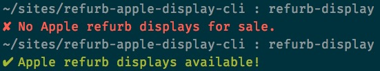

# Refurb Apple Display CLI

_CLI tool for checking if Apple has refurb displays available._

Inspired by [Potch’s 2015 Cascadia talk](http://2015.cascadiajs.com/assets/transcripts/03-08-potch.txt) on making command line tools for learning/fun, I made this little utility. It checks Apple’s [refurb store page](http://www.apple.com/shop/browse/home/specialdeals/mac) to see if Cinema displays are available for purchase.

**Disclaimer: this project is a personal exploration of writing a CLI tool using Node.js. It is not intended for public use.**

## Installation

I’m not publishing this package to NPM because it doesn’t serve much purpose. If you want to use it:

1. Make sure you have Node.js installed
2. Download or `git clone` this repo to your machine
3. Run `npm link` in the directory

## Use

Run `refurb-display` in a terminal. You’ll should see:

## Helpful Links:

* [Potch on Twitter](https://twitter.com/potch)
* [flight-status](https://github.com/potch/flight-status), Potch’s example CLI tool
* [“Writing a Command Line Node Tool” on JavaScript Playground](http://javascriptplayground.com/blog/2012/08/writing-a-command-line-node-tool/)
